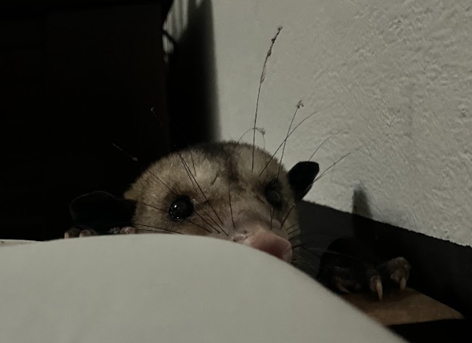

# Emily Bolaños Carvajal

Bach. en Geografia

Correo
- embc0708@gmail.com
Telefono
- 88859871

LinkedIn
- linkedin.com/in/emily-bolaños-828090220

>Geógrafa comprometida con la conservación ambiental. Mi objetivo es adquirir experiencia valiosa que siente las bases para
un futuro comprometido con el manejo sostenible de recursos. Mi formación académica y profesional me han equipado con
conocimientos en geografía ambiental, cartografía y análisis espacial. Poseo habilidades analíticas, capacidad para trabajar en
equipo y una actitud proactiva.

## Experiencia
#### <pre> 2024 - Presente </pre>
<pre> Pasantía | Inventario Forestal Nacional (IFN-SINAC) </pre>

#### <pre> 2024 - Presente </pre>
<pre> Asistente | Investigación Geográfica (Asistente para Ph.D. Alejandro Cascante Campos) </pre>

####  <pre> 2023 - Presente </pre>
<pre> Mentor | Rally de Tecnologias Espaciales </pre>

## Educacion
#### <pre> 2023 - Presente </pre>
<pre> Bach. y Lic. en Psicología | Universidad de Costa Rica </pre>

#### 2020 - Presente
<pre> Bach. y Lic. en Geografía | Universidad de Costa Rica </pre>

#### <pre> 2018 - 2019 </pre>
<pre> Bachillerato Internacional Palmares | Colegio Bilingüe de Palmares </pre>

## Habilidades y Competencias
<pre>
- Manejo de Español (Nativo)
- Manejo de Inglés (B2+)
- Conocimiento en Softwares del área de Sistemas de Información Geográfica (QGIS, ARCGIS, Mapbox, Otros)
- Comunicación asertiva
- Facilidad para el trabajo en equipos
</pre>

